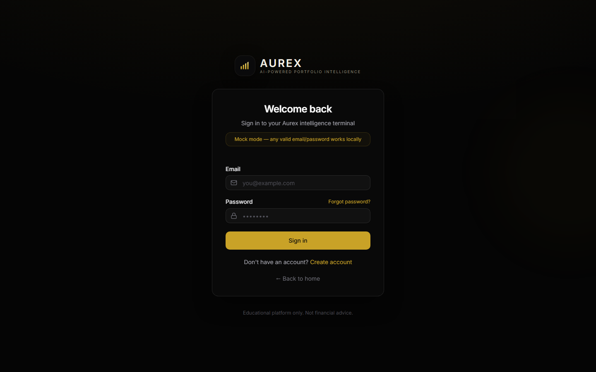

# Aurex — AI-Powered Portfolio Intelligence

<p align="center">
  <strong>Plataforma premium de inteligencia financiera para portafolios de inversión simulados.</strong>
</p>

<p align="center">
  <em>Simula inversiones · Analiza portafolios · Visualiza mercados · Genera insights educativos con IA</em>
</p>

<p align="center">
  
  
  
  
</p>

---

## Vista del producto

<p align="center">
  
</p>

<p align="center">
  
  
</p>

---

## Qué es Aurex

**Aurex** es una plataforma web full-stack para simular, monitorear y analizar portafolios de inversión sin utilizar dinero real.

El usuario puede crear portafolios simulados, registrar compras y ventas ficticias, consultar activos de mercado, crear alertas, visualizar métricas financieras y generar análisis educativo asistido por IA.

Aurex está diseñado como una experiencia **fintech premium**, combinando una interfaz moderna tipo dashboard financiero con una arquitectura backend real, segura y desplegada en la nube.

---

## Para qué sirve

Aurex ayuda a responder preguntas clave sobre un portafolio de inversión simulado:

```txt
¿Cuánto vale mi portafolio?
¿Qué activos tengo?
¿Cuánto estoy ganando o perdiendo?
¿Cómo está distribuido mi capital?
¿Qué tan riesgosa es mi concentración de activos?
¿Qué alertas de mercado quiero monitorear?
¿Qué análisis educativo puede darme la IA?
