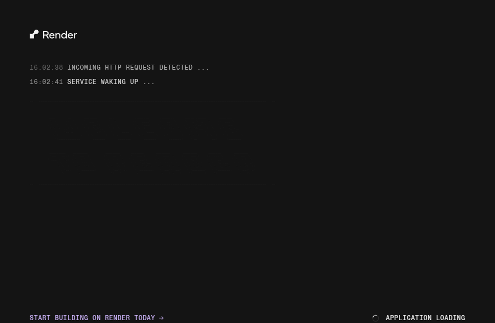
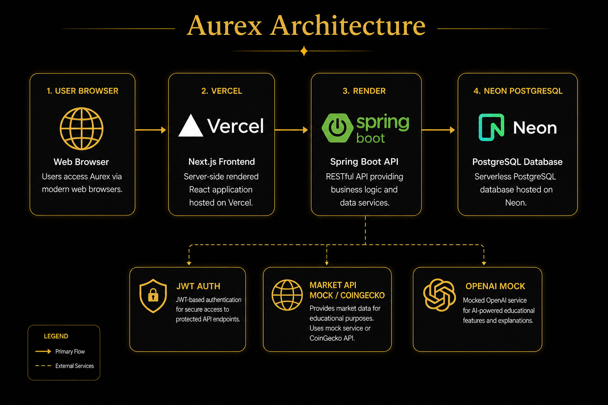

# AUREX — AI-Powered Portfolio Intelligence

Monorepo del proyecto **Aurex**: plataforma educativa de inteligencia de portafolios simulados (crypto, acciones, alertas e IA).

| Carpeta | Stack | Descripción |
|---------|--------|-------------|
| [`frontend/`](./frontend/) | Next.js 16, TypeScript, Tailwind | UI web, modo mock/api |
| [`backend/`](./backend/) | Spring Boot 3.3, Java 21, PostgreSQL | API REST + JWT |
| [`frontend/docs/`](./frontend/docs/) | Markdown | Documentación técnica |
| [`docs/images/`](./docs/images/) | Capturas | Screenshots de producto y despliegue |

## Capturas

| Vista | Imagen |
|-------|--------|
| Landing |  |
| Dashboard |  |
| Markets |  |
| Backend health (Render) |  |
| Frontend (Vercel) |  |
| Arquitectura |  |

## Inicio rápido

### Backend

**Sin Docker (rápido):**

```bash
cd backend
./gradlew bootRun
```

**Con PostgreSQL + Redis:**

```bash
cd backend
docker compose up -d
./gradlew bootRun -Dspring.profiles.active=default
```

API: `http://localhost:8080/api`

### Frontend

```bash
cd frontend
cp .env.example .env.local
pnpm install
pnpm dev
```

App: `http://localhost:3000`

Modo API: `NEXT_PUBLIC_DATA_MODE=api` en `.env.local`

## Producción

| Entorno | URL |
|---------|-----|
| Frontend (Vercel) | https://aurex-investments.vercel.app |
| Repositorio | https://github.com/Juanitowski-8/AUREX---INVESTMENTS |
| Backend (Render) | Web Service Docker en `backend/` — ver [backend/README.md](./backend/README.md#deploy-on-render-docker) |

**Vercel (modo API):**

```env
NEXT_PUBLIC_DATA_MODE=api
NEXT_PUBLIC_API_BASE_URL=https://aurex-backend-qthi.onrender.com/api
```

**Render:** `CORS_ALLOWED_ORIGINS=https://aurex-investments.vercel.app` (sin barra final).

Registro e inicio de sesión en `/register` y `/login`.

## Documentación

Ver [`frontend/docs/README.md`](./frontend/docs/README.md).

## Disclaimer

Aurex es educativo. No ejecuta operaciones reales ni constituye asesoría financiera.
