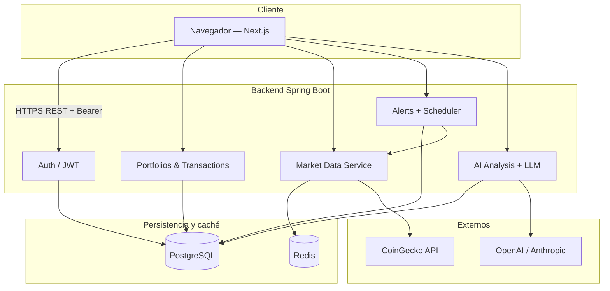

# Arquitectura — Aurex

## Descripción general

**Aurex** es una plataforma de inteligencia de portafolios **educativa y simulada**. No ejecuta operaciones reales en mercados ni ofrece asesoría financiera. Combina un frontend web premium con un API REST que centraliza autenticación, datos de mercado, portafolios simulados, alertas de precio y análisis asistido por IA.

El sistema se divide en dos repositorios principales:

| Componente | Tecnología | Repositorio típico |
|------------|------------|-------------------|
| Frontend | Next.js 16, React 19, TypeScript | `Aurex-frontend` |
| Backend | Spring Boot 3.3, Java 21 | `aurex-backend` |

---

## Current Status

### Frontend (Next.js)

- UI multipágina: landing, dashboard, mercados, portafolio, alertas, AI insights, ajustes.
- Capa de servicios con dos modos: **`mock`** (datos locales) y **`api`** (HTTP al backend).
- Cliente HTTP (`lib/api-client.ts`): base URL, JWT en `Authorization: Bearer`, envoltorio `ApiResponse`.
- Autenticación: página `/login`, guard de rutas internas en modo `api`, logout.
- Diseño dark “luxury fintech” (Tailwind, shadcn/ui, Framer Motion, Recharts).

### Backend (Spring Boot)

- API REST bajo prefijo `/api`.
- Autenticación JWT + BCrypt; roles `USER` / `ADMIN`.
- Dominio: usuarios, portafolios, activos, holdings, transacciones, snapshots de precio.
- Mercado: proveedor `mock` o `coingecko` con fallback y caché Redis.
- Alertas: reglas, eventos, job programado de evaluación.
- IA: análisis educativo con proveedores `mock`, `openai` o `anthropic` (fallback a mock).
- PostgreSQL + Flyway; Redis para caché de mercado.

### Infraestructura local

- **PostgreSQL 16** y **Redis 7** vía `docker compose` en el backend.

---

## Planned

- Despliegue productivo (Vercel + PaaS backend + DB gestionada). Ver [deployment.md](./deployment.md).
- App de escritorio (Electron/Tauri) como cliente opcional.
- Notificaciones externas (p. ej. WhatsApp vía OpenWA) — solo diseño de roadmap.
- CI/CD automatizado, observabilidad avanzada, registro de usuario en UI del frontend.
- Endpoints dedicados de performance histórica del portafolio (hoy parte del resumen/mercado se deriva en frontend).

---

## Diagrama lógico (alto nivel)



---

## Frontend (Next.js)

**Responsabilidades**

- Presentación y UX.
- Modo `NEXT_PUBLIC_DATA_MODE=mock|api`.
- Almacenamiento del **access token** solo en el navegador (`localStorage`, clave `aurex_token`) — nunca claves de LLM ni de mercado.

**Estructura relevante**

```
app/                 # Rutas App Router
components/          # UI y layout (dashboard-layout, auth)
services/            # auth, market, portfolio, alerts, ai
lib/api-client.ts    # Cliente HTTP
lib/api/mappers.ts   # DTO backend → tipos UI
hooks/               # Carga de datos por pantalla
```

---

## Backend (Spring Boot)

**Responsabilidades**

- Reglas de negocio, ownership por usuario (JWT).
- Integración con CoinGecko y LLM solo en servidor.
- Validación, migraciones Flyway, respuestas uniformes `ApiResponse<T>`.

**Módulos por paquete**

| Paquete | Función |
|---------|---------|
| `auth` | Registro, login, `/me` |
| `user` | Entidad usuario |
| `portfolio` | Portafolios, holdings, transacciones, resumen |
| `market` | Activos, ticker, historial, caché |
| `alert` | Reglas, eventos, evaluación periódica |
| `ai` | Generación y listado de análisis |
| `common` | JWT, excepciones, health |

---

## PostgreSQL

- Fuente de verdad relacional: usuarios, portafolios, posiciones, transacciones, alertas, análisis IA, catálogo de activos.
- Esquema versionado con **Flyway** (`V1`–`V7`). Detalle en [database-model.md](./database-model.md).

---

## Redis

- **Current Status:** caché de respuestas de mercado (ticker e historial), TTL configurable (~60 s).
- Reduce llamadas a CoinGecko y mejora latencia.
- Si Redis no está disponible, el backend sigue respondiendo (miss de caché / bypass).

---

## Market Data API

- Abstracción `MarketDataProvider`: implementaciones **mock** y **CoinGecko**.
- `FallbackMarketDataProvider`: intenta CoinGecko y cae a mock en error o rate limit.
- Endpoints expuestos: `/api/market/ticker`, `/assets`, `/history/{symbol}`.
- Catálogo de activos administrado en tabla `assets` (`/api/assets`).

---

## AI Analysis

- Servicio que construye un contexto **sanitizado** (métricas de portafolio, sin email ni JWT).
- `LLMProvider`: mock, OpenAI (WebClient), Anthropic (WebClient); fallback a mock si falla o respuesta no válida.
- Resultado persistido en `ai_analyses` con disclaimer fijo educativo.
- No genera recomendaciones de compra/venta; validación post-respuesta de patrones prohibidos.

---

## Flujo de datos (ejemplos)

### Login y dashboard

1. Usuario envía email/password a `POST /api/auth/login`.
2. Backend valida con BCrypt, devuelve `accessToken` + usuario.
3. Frontend guarda token y llama rutas protegidas con `Authorization: Bearer`.
4. `GET /api/portfolios` + `GET /api/portfolios/{id}/summary` alimentan el dashboard.

### Transacción simulada

1. `POST /api/transactions` (BUY/SELL) con símbolo de activo.
2. Backend recalcula `holdings` (promedio ponderado / reducción de cantidad).
3. El resumen del portafolio refleja P/L y asignación actualizados.

### Alerta de precio

1. Usuario crea `alert_rules` vía `POST /api/alerts`.
2. Job `AlertEvaluationJob` (intervalo configurable) consulta precios vía `MarketDataService`.
3. Si se cumple condición ABOVE/BELOW, crea `alert_events` y puede desactivar la regla.

### Análisis IA

1. `POST /api/ai/portfolio-summary/{portfolioId}` calcula métricas del resumen.
2. LLM (o mock) devuelve JSON estructurado: summary, riskLevel, observations, disclaimer.
3. Se guarda fila en `ai_analyses`; el frontend lista con `GET /api/ai/analyses`.

---

## Principios de diseño

- **Seguridad en backend:** secretos y API keys solo en variables de entorno del servidor.
- **Educational-only:** copy y prompts evitan asesoría y órdenes de trading.
- **Resiliencia:** fallbacks (CoinGecko→mock, OpenAI→mock, Redis opcional).
- **Separación mock/api en frontend** para demos sin infraestructura.
