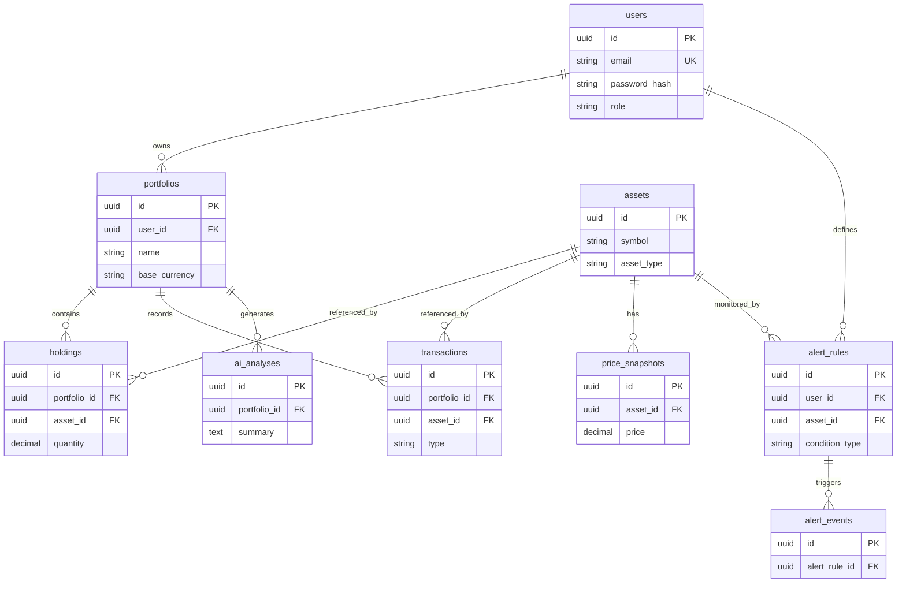

# Modelo de datos — Aurex

## Alcance

Este documento describe el esquema **PostgreSQL** gestionado por **Flyway** en el backend (`aurex-backend`). Las migraciones actuales van de `V1` a `V7`.

**Current Status:** todas las tablas listadas existen y están en uso por la API.  
**Planned:** posibles extensiones (sesiones refresh, auditoría, notificaciones outbound) sin migraciones definidas aún.

---

## Diagrama entidad-relación (simplificado)

---

## Tablas

### `users`

| Columna | Tipo | Descripción |
|---------|------|-------------|
| `id` | UUID PK | Identificador del usuario |
| `full_name` | VARCHAR(255) | Nombre mostrado |
| `email` | VARCHAR(255) UNIQUE | Login; no se envía a LLM |
| `password_hash` | VARCHAR(255) | Hash BCrypt; nunca expuesto en API |
| `role` | VARCHAR(32) | `USER` o `ADMIN` |
| `enabled` | BOOLEAN | Cuenta activa |
| `created_at`, `updated_at` | TIMESTAMPTZ | Auditoría básica |

**Propósito:** autenticación y aislamiento de datos por usuario.

---

### `assets`

| Columna | Tipo | Descripción |
|---------|------|-------------|
| `id` | UUID PK | Identificador interno |
| `symbol` | VARCHAR(32) | Ej. BTC, AAPL |
| `name` | VARCHAR(255) | Nombre legible |
| `asset_type` | VARCHAR(32) | CRYPTO, STOCK, ETF, CASH |
| `external_id` | VARCHAR(128) | ID proveedor (p. ej. `bitcoin` en CoinGecko) |
| `source` | VARCHAR(64) | Origen del catálogo/precio |
| `active` | BOOLEAN | Visible en listados |

**Restricción:** `UNIQUE (symbol, asset_type)`.

**Propósito:** catálogo maestro de instrumentos simulados. Seeds en `V3`, `V4`.

---

### `portfolios`

| Columna | Tipo | Descripción |
|---------|------|-------------|
| `id` | UUID PK | Portafolio simulado |
| `user_id` | UUID FK → `users` | Propietario |
| `name` | VARCHAR(255) | Nombre editable |
| `base_currency` | VARCHAR(8) | Moneda de referencia (default USD) |
| `description` | VARCHAR(1000) | Opcional |

**Propósito:** contenedor de holdings y transacciones por usuario.

---

### `holdings`

| Columna | Tipo | Descripción |
|---------|------|-------------|
| `id` | UUID PK | Posición |
| `portfolio_id` | UUID FK | Portafolio |
| `asset_id` | UUID FK | Activo |
| `quantity` | DECIMAL(28,8) | Cantidad actual |
| `average_buy_price` | DECIMAL(19,4) | Coste medio (BUY ponderado) |

**Restricción:** `UNIQUE (portfolio_id, asset_id)` — una fila por activo por portafolio.

**Propósito:** estado actual de la cartera; se recalcula tras cada transacción.

---

### `transactions`

| Columna | Tipo | Descripción |
|---------|------|-------------|
| `id` | UUID PK | Operación simulada |
| `portfolio_id` | UUID FK | Portafolio |
| `asset_id` | UUID FK | Activo |
| `type` | VARCHAR(16) | `BUY` o `SELL` |
| `quantity` | DECIMAL(28,8) | Unidades |
| `price` | DECIMAL(19,4) | Precio unitario en la operación |
| `transaction_date` | TIMESTAMPTZ | Fecha efectiva |
| `notes` | VARCHAR(1000) | Opcional |

**Propósito:** historial de operaciones simuladas; base para P/L y holdings.

---

### `price_snapshots`

| Columna | Tipo | Descripción |
|---------|------|-------------|
| `id` | UUID PK | Snapshot |
| `asset_id` | UUID FK | Activo |
| `price` | DECIMAL(19,4) | Precio capturado |
| `currency` | VARCHAR(8) | Moneda |
| `source` | VARCHAR(64) | MOCK, COINGECKO, etc. |
| `captured_at` | TIMESTAMPTZ | Momento de captura |

**Propósito:** histórico/mock de precios; seeds en `V5` para desarrollo.

---

### `alert_rules`

| Columna | Tipo | Descripción |
|---------|------|-------------|
| `id` | UUID PK | Regla |
| `user_id` | UUID FK | Dueño |
| `asset_id` | UUID FK | Activo vigilado |
| `condition_type` | VARCHAR(16) | `ABOVE` o `BELOW` |
| `target_price` | DECIMAL(19,4) | Umbral |
| `enabled` | BOOLEAN | Activa / pausada |

**Propósito:** definición de alertas educativas de precio.

---

### `alert_events`

| Columna | Tipo | Descripción |
|---------|------|-------------|
| `id` | UUID PK | Evento disparado |
| `alert_rule_id` | UUID FK | Regla origen |
| `triggered_price` | DECIMAL(19,4) | Precio al disparo |
| `message` | VARCHAR(1000) | Mensaje descriptivo |
| `triggered_at` | TIMESTAMPTZ | Timestamp |
| `read_flag` | BOOLEAN | Leído en UI (futuro) |

**Propósito:** log de alertas activadas por el job de evaluación.

---

### `ai_analyses`

| Columna | Tipo | Descripción |
|---------|------|-------------|
| `id` | UUID PK | Análisis |
| `portfolio_id` | UUID FK | Portafolio analizado |
| `summary` | TEXT | Resumen educativo |
| `risk_level` | VARCHAR(16) | Low, Moderate, High |
| `concentration_notes` | TEXT | Notas de concentración |
| `observations` | TEXT | JSON array serializado (lista de strings) |
| `disclaimer` | VARCHAR(1000) | Aviso legal fijo |
| `created_at` | TIMESTAMPTZ | Creación |

**Propósito:** persistir salidas de IA/mock por portafolio para historial en UI.

---

## Relaciones y reglas de integridad

| Relación | ON DELETE | Notas |
|----------|-----------|-------|
| `portfolios.user_id` → `users` | CASCADE | Borrar usuario elimina sus portafolios |
| `holdings.portfolio_id` → `portfolios` | CASCADE | |
| `holdings.asset_id` → `assets` | RESTRICT | No borrar activo con posiciones |
| `transactions` → `portfolios` / `assets` | CASCADE / RESTRICT | Igual que holdings |
| `alert_rules.user_id` | CASCADE | |
| `alert_events.alert_rule_id` | CASCADE | |
| `ai_analyses.portfolio_id` | CASCADE | |

---

## Redis (no relacional)

**Current Status:** no almacena entidades de negocio; solo claves de caché temporales (`market:ticker:…`, `market:history:…`). Ver [architecture.md](./architecture.md).

---

## Planned (modelo)

- Tabla de refresh tokens o sesiones revocables.
- Tabla de preferencias de notificación (email/WhatsApp).
- Índices adicionales si crece volumen de transacciones/eventos.
