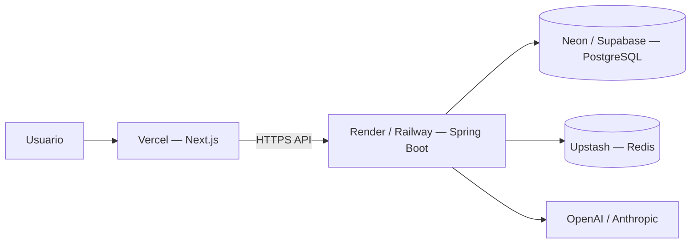

# Despliegue — Aurex

## Estado

| Componente | Current Status | Planned |
|------------|----------------|---------|
| Frontend Next.js | Local / manual | **Vercel** |
| Backend Spring Boot | Local / JAR manual | **Render** o **Railway** |
| PostgreSQL | Docker local | **Neon** o **Supabase** |
| Redis | Docker local | **Upstash** |
| CI/CD | Manual (`gradle test`, `pnpm build`) | GitHub Actions |
| Dominio / HTTPS | No configurado | Reverse proxy + certificado |

Este documento describe la **arquitectura objetivo** y pasos de referencia. No implica que los entornos cloud ya estén provisionados.

---

## Arquitectura de despliegue (objetivo)



---

## Frontend — Vercel (Planned)

### Repositorio

- Proyecto: `Aurex-frontend` (raíz con `package.json`, `app/`).

### Build

- Framework: **Next.js**
- Comando build: `pnpm build` (o `npm run build`)
- Output: estándar Next.js

### Variables de entorno (Vercel)

| Variable | Ejemplo | Notas |
|----------|---------|-------|
| `NEXT_PUBLIC_API_BASE_URL` | `https://api.aurex.example.com/api` | URL pública del backend |
| `NEXT_PUBLIC_DATA_MODE` | `api` | Producción debe usar `api` |

**No configurar** en Vercel: `JWT_SECRET`, `OPENAI_API_KEY`, etc.

### Dominio

- Subdominio sugerido: `app.aurex.example.com` o proyecto `*.vercel.app` para demos.

---

## Backend — Render o Railway (Planned)

### Repositorio

- Proyecto: `aurex-backend` (Gradle, `bootJar`).

### Build & start

```bash
./gradlew bootJar
java -jar build/libs/aurex-backend-*.jar
```

- Puerto: `SERVER_PORT` (default 8080); la plataforma inyecta `PORT`.
- Health check: `GET /actuator/health` o `GET /api/health`.

### Variables de entorno (backend)

| Variable | Obligatoria | Descripción |
|----------|-------------|-------------|
| `SPRING_DATASOURCE_URL` | Sí | JDBC PostgreSQL (Neon/Supabase) |
| `SPRING_DATASOURCE_USERNAME` | Sí | Usuario BD |
| `SPRING_DATASOURCE_PASSWORD` | Sí | Contraseña BD |
| `JWT_SECRET` | Sí | Secreto largo aleatorio |
| `JWT_EXPIRATION_MS` | No | TTL token |
| `CORS_ALLOWED_ORIGINS` | Sí | URL del frontend Vercel |
| `REDIS_HOST` | Si cache | Host Upstash |
| `REDIS_PORT` | Si cache | Puerto |
| `REDIS_PASSWORD` | Upstash | Password TLS |
| `AUREX_MARKET_PROVIDER` | No | `coingecko` recomendado en prod |
| `AUREX_AI_PROVIDER` | No | `openai` / `anthropic` / `mock` |
| `OPENAI_API_KEY` | Si OpenAI | Solo servidor |
| `ANTHROPIC_API_KEY` | Si Anthropic | Solo servidor |
| `AUREX_ALERTS_EVALUATION_ENABLED` | No | `true` en prod si se usan alertas |

### Flyway

- **Current Status:** migraciones se aplican al arranque (`spring.flyway.enabled=true`).
- Asegurar que el usuario JDBC tenga permisos DDL en el primer deploy.

---

## PostgreSQL — Neon o Supabase (Planned)

| Proveedor | Ventaja |
|-----------|---------|
| **Neon** | Serverless Postgres, branching para previews |
| **Supabase** | Postgres + panel; familiar para equipos |

### Configuración

1. Crear proyecto y base `aurex_db` (o nombre elegido).
2. Copiar connection string JDBC:
   - `jdbc:postgresql://<host>/<db>?sslmode=require`
3. Asignar a `SPRING_DATASOURCE_*` en el PaaS del backend.

### Backups

- Activar backups automáticos del proveedor (Planned operación).

---

## Redis — Upstash (Planned)

- Crear base Redis serverless.
- Obtener endpoint, puerto y password.
- Mapear a `REDIS_HOST`, `REDIS_PORT`, y password según cliente Spring (propiedades del proyecto).

**Current Status local:** Redis sin password en Docker.

Si Redis no está disponible en cloud, el backend puede operar con cache deshabilitado:

```properties
aurex.market.cache-enabled=false
```

---

## Variables de entorno — resumen cruzado

### Solo backend (secreto)

```
JWT_SECRET=
OPENAI_API_KEY=
ANTHROPIC_API_KEY=
SPRING_DATASOURCE_PASSWORD=
REDIS_PASSWORD=
```

### Backend (no secreto)

```
CORS_ALLOWED_ORIGINS=https://tu-app.vercel.app
AUREX_MARKET_PROVIDER=coingecko
AUREX_AI_PROVIDER=openai
```

### Solo frontend (público)

```
NEXT_PUBLIC_API_BASE_URL=https://api.tudominio.com/api
NEXT_PUBLIC_DATA_MODE=api
```

---

## CI/CD (Planned)

Pipeline sugerido en **GitHub Actions**:

### Backend (`aurex-backend`)

```yaml
# jobs: test
- JDK 21
- ./gradlew test
# jobs: build (en tag o main)
- ./gradlew bootJar
- artefacto JAR
```

### Frontend (`Aurex-frontend`)

```yaml
# jobs: lint + typecheck
- pnpm install
- pnpm exec tsc --noEmit
- pnpm lint
# Vercel deploy: integración nativa en push a main
```

**Current Status:** ejecución manual local; sin workflows commiteados.

---

## Checklist primer despliegue

1. [ ] Provisionar PostgreSQL y ejecutar migraciones vía arranque del backend.
2. [ ] Provisionar Redis (o desactivar cache).
3. [ ] Desplegar backend; verificar `/api/health`.
4. [ ] Configurar CORS con URL exacta de Vercel.
5. [ ] Desplegar frontend con `NEXT_PUBLIC_API_BASE_URL` correcto.
6. [ ] Registrar usuario de prueba vía `POST /auth/register`.
7. [ ] Probar login en `/login` y flujo dashboard.
8. [ ] Rotar `JWT_SECRET` si hubo exposición en logs.

---

## Desarrollo local (Current Status)

Referencia rápida — ya funciona hoy:

```bash
# Backend
cd aurex-backend
docker compose up -d
cp .env.example .env   # editar JWT_SECRET
./gradlew bootRun

# Frontend
cd Aurex-frontend
cp .env.example .env.local
pnpm install && pnpm dev
```

- Backend: `http://localhost:8080`
- Frontend: `http://localhost:3000`
- Modo integrado: `NEXT_PUBLIC_DATA_MODE=api`

---

## Costes orientativos (Planned)

| Servicio | Tier free típico |
|----------|------------------|
| Vercel | Hobby / Pro según equipo |
| Render / Railway | Free tier con límites de sleep |
| Neon / Supabase | Free tier con límites de storage |
| Upstash | Free tier requests/día |
| OpenAI | Pay-per-use |

Ajustar según tráfico académico vs demo pública.
